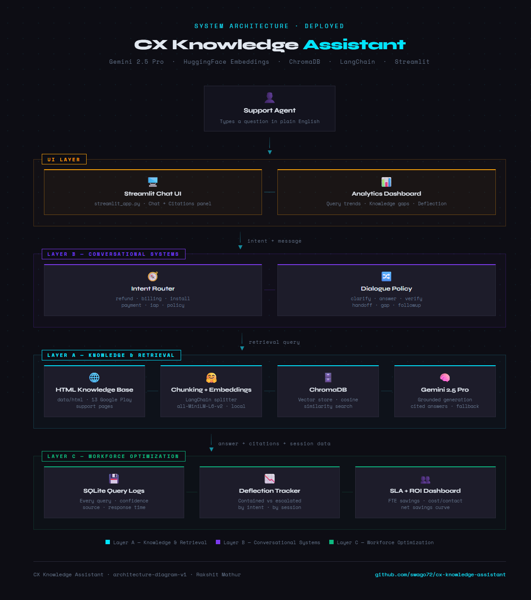

# CX Knowledge Assistant — Production-Safe RAG + Analytics Demo

An LLM-powered customer support knowledge assistant built with a production-oriented Retrieval-Augmented Generation (RAG) architecture and an embedded analytics dashboard.

The system ingests HTML knowledge base articles, chunks and embeds them, stores them in ChromaDB, retrieves semantically relevant content, and generates source-grounded responses with fallback protection. It also logs query telemetry to power containment, escalation, and knowledge-gap analytics in Streamlit.

## What This Project Demonstrates

- Source-grounded customer support Q&A
- Retrieval-Augmented Generation (RAG)
- Semantic search with SentenceTransformers + ChromaDB
- Dialogue policy with ANSWER / CLARIFY / HANDOFF states
- Query logging and telemetry analytics
- Knowledge-gap detection
- Workforce impact simulation
- Streamlit deployment

## Architecture Diagram



## System Design Evolution

### V1 — Enterprise Modular Architecture
- FastAPI backend
- OpenAI GPT-based RAG design
- SQLite with PostgreSQL upgrade path
- Dedicated ingestion + analytics layer

Designed as an enterprise-ready foundation for CCaaS-style deployment.

[View Architecture v1](docs/01_mvp_enterprise_architecture.html)

---

### V2 — Simplified Cost-Optimized Stack
- Streamlit-based application
- Google Gemini via LangChain
- Local HuggingFace embeddings
- ChromaDB vector store
- SQLite telemetry and analytics
- Lower infrastructure complexity for fast deployment

Designed as a lightweight, deployable, portfolio-ready AI support operations demo.

[View Architecture v2](docs/02_cost_optimized_gemini_architecture.html)

## Architecture Overview

### Ingestion Layer
- HTML cleaning and normalization with BeautifulSoup
- Recursive chunking with overlap
- SentenceTransformer embeddings using `all-MiniLM-L6-v2`
- ChromaDB knowledge base creation from `data/html`

### Retrieval Layer
- Cosine similarity search over embedded chunks
- Top-k retrieval with metadata and distance tracking
- Retrieval confidence diagnostics

### Dialogue + Response Layer
- Intent routing
- Dialogue decision policy:
  - `ANSWER`
  - `CLARIFY`
  - `HANDOFF`
- Gemini-based answer generation
- Strict source-grounded prompting
- Fallback behavior for weak retrieval

### Analytics Layer
- SQLite query logging
- Containment metrics
- Daily query volume
- Escalation reason tracking
- Knowledge-gap detection
- Workforce impact simulation dashboard

## Tech Stack

- Python 3.11
- Streamlit
- Google Gemini (via LangChain)
- SentenceTransformers
- ChromaDB
- BeautifulSoup
- SQLite
- Pandas

## Project Structure

```text
cx-knowledge-assistant/
├── streamlit_app.py
├── requirements.txt
├── data/
│   └── html/
├── src/
│   ├── analytics.py
│   ├── config.py
│   ├── ingestion.py
│   ├── rag.py
│   └── dialogue/
└── docs/
```

## Setup
    pip install -r requirements.txt
    # Create .env Add GOOGLE_API_KEY
    streamlit run streamlit_app.py

## Status
- [x] Step 1: Ingestion pipeline
- [x] Step 2: RAG + response generation
- [x] Step 3: Dialogue policy and fallback logic
- [x] Step 4: Telemetry logging
- [x] Step 5: Streamlit analytics dashboard
- [x] Step 6: Deploy
- [ ] Step 7: Polish
